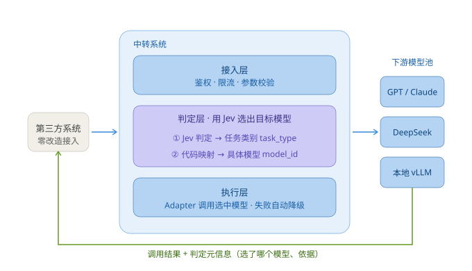

# LLM 路由中转系统 · 项目文档中心

> 工程方法论：**OPD（One-Person Development，一人AI开发·四维数字员工开发工程）**
> 文档版本：V1.6.1 ｜ 建立日期：2026-09-21 ｜ 责任方：HD（齐活林，交付总监）

---

## 一、OPD 四维数字员工

| 数字员工 | 代号 | 核心定位 | 主要职责 |
|---|---|---|---|
| 系统设计员工 | SDA | 架构规划师 | 需求分析、架构设计、技术选型、接口与数据库设计 |
| 软件编码员工 | SEA | 代码实现者 | 功能开发、代码编写、单元测试、部署配置 |
| 软件审核员工 | SRA | 质量守门员 | 代码审查、安全审核、设计审核、规范检查 |
| 软件测试员工 | STA | 质量验证者 | 测试设计、测试执行、缺陷管理、质量评估 |
| 人类开发者 | HD | 决策中心 | 需求主导、关键决策、资源管理、最终验收 |

---

## 二、文档目录结构

```
docs/
├── README.md                          # 本文件：项目文档中心 + 全阶段共享基线
├── assets/                            # 文档配图（SVG 源文件）
│   └── 01-request-flow.svg            # 整体调用链路图
├── 阶段一-需求与规划/
│   ├── 01-需求规格说明书.md            # SDA + HD
│   ├── 02-前端UI设计说明书.md          # SDA
│   ├── 03-项目计划.md                  # HD
│   ├── 04-验收标准.md                  # HD
│   ├── 05-风险清单.md                  # HD
│   └── 06-需求澄清记录.md              # HD + SDA（Jev 引入决策留痕）
├── 阶段二-设计与架构/
│   ├── 01-架构设计文档.md              # SDA
│   ├── 02-接口设计说明书.md            # SDA
│   ├── 03-前端技术设计说明书.md        # SDA
│   ├── 04-后端技术设计说明书.md        # SDA
│   ├── 05-数据库设计.sql               # SDA
│   ├── 06-安全方案文档.md              # SDA
│   └── 07-设计审核报告.md              # SRA
├── 阶段三-开发与实现/
│   ├── 01-技术实现文档.md              # SEA
│   ├── 02-代码审查报告.md              # SRA
│   └── 03-端到端联调验证记录.md        # SEA（开发期自测，非阶段四正式测试）
├── 阶段四-测试与验证/
│   ├── 01-测试计划.md                  # STA
│   ├── 02-测试用例.md                  # STA
│   ├── 03-缺陷报告.md                  # STA
│   ├── 04-测试报告.md                  # STA
│   └── 05-质量评估报告.md              # STA + HD
├── 阶段五-部署与交付/
│   ├── 01-部署文档.md                  # SEA
│   ├── 02-发布说明.md                  # SEA
│   ├── 03-用户手册.md                  # SEA
│   ├── 04-运维手册.md                  # SEA
│   └── 05-安装打包说明.md              # HD（执行手册，打包与安装以它为准）
└── 阶段六-运维与迭代/
    ├── 01-运维报告.md                  # STA
    ├── 02-问题分析报告.md              # STA
    ├── 03-迭代计划.md                  # HD
    └── 04-优化建议.md                  # HD
```

---

## 三、全阶段共享基线（所有文档必须与此一致）

> 本章是全项目**唯一事实来源**。任何阶段文档若与本章冲突，以本章为准。

### 3.1 项目一句话定义

输入一段用户文本，**先交由 Jev 决策模型判定**该路由到哪个下游大模型，再调用目标模型完成生成并返回；同时提供可视化控制台用于配置与观测。

### 3.1.1 整体调用链路



> 第三方系统只需把 `base_url` 指向本系统、`model` 传 `"auto"`，选哪个模型、调哪家厂商、失败如何降级全部由中转内部完成。**第三方拿到的只有结果，模型池与厂商密钥始终留在中转内部。**

链路各环节的职责与约束：

| # | 环节 | 职责 | 关键约束 |
|---|---|---|---|
| 1 | 第三方系统 | 发起 OpenAI 兼容请求 | 零业务改造，仅改接入地址；`model = "auto"` 触发自动路由 |
| 2 | 接入层 | 鉴权、配额、限流、参数校验、协议归一 | 不合规请求在此拦截，不进路由；协议差异在入口统一吸收 |
| 3 | 判定层 | ① Jev 判定出 `task_type`（含复杂度、特征标记）<br>② 代码映射表据 `task_type` 选出 `model_id` | 必须在**下游调用之前**完成；`probabilities` 与 `confidence` 必须落库 |
| 4 | 执行层 | 经 Adapter 调用选中模型；失败按 `priority` 降级 | 兜底率 100%，不向第三方透出 5xx；`fallback_reason` 必记录 |
| 5 | 下游模型池 | 实际生成 | 厂商协议与流式格式差异全部由 Adapter 屏蔽，不外泄至路由层与接口层 |
| 6 | 结果回流 | 结果 + 判定元信息返回第三方 | 元信息走**响应头**（流式下 body 无法附加字段） |

响应头约定（第三方可选读，不读也不影响调用）：

| 响应头 | 含义 | 取值时机 |
|---|---|---|
| `x-router-model` | 本次实际调用的模型 | 始终返回 |
| `x-router-layer` | 判定命中的层级（`L1` / `L2` / `L3`） | 始终返回 |
| `x-router-task-type` | Jev 判定出的任务类别 | 仅 L2 命中时返回；L1 规则短路不经 Jev，无此项 |
| `x-router-confidence` | 判定置信度（Jev 校准值；L1 命中恒为 `1.0`） | 始终返回 |
| `x-router-trace-id` | 全链路追踪 ID，报障时提供给运维 | 始终返回 |

> **`x-router-layer` 不可省**：L1 规则命中时 Jev 根本未被调用，此时 `task-type` 与 `confidence` 反映不了真实判定过程，只有层级字段能说明「这次是规则秒判的」。

**为什么判定必须前置**：路由决策与下游生成是**串行**关系——不知道调谁就无法发起请求。因此本系统必然存在一层额外延迟（Jev 70~500ms），这正是基线中「路由决策额外延迟 ≤ 800ms（P95）」这项指标的由来。流式场景同理：首个 token 下发前路由必须已定死，**不允许先返回再改道**，否则第三方会收到两个模型拼接的回答。

**责任边界**：第三方按本系统计价并直接向本系统报障，上游厂商的限流、涨价、协议变更均由本系统消化。这一点直接决定了降级与兜底策略必须是**内部静默**的。

### 3.2 核心设计结论

1. **系统本质 = LLM 网关（Gateway）+ 智能路由（Router）**，前后端分离。不是「两次 API 串联」的小工具。
2. **判定模型 = Jev**（TypeSafe AI 的 System One 决策模型，2026-09-15 发布）。需求指定：输入文本**先交由 Jev 判定**该调用哪个下游模型，再调用目标模型返回。Jev 不生成任何文本，只输出**带校准概率的类型化判定**；延迟 70~500ms，输入 $0.042/M token、输出 token 免费。
3. 路由决策分三层，**越便宜的手段越靠前**：

| 层级 | 手段 | 额外延迟 | 成本 |
|---|---|---|---|
| L1 规则短路 | 关键词 / 正则 / 租户白名单 / 显式指定 | ~0ms | 0 |
| L2 Jev 判定 | 单次调用并行提问（Choice + Score + Noul），输出任务类别与特征标记 | 70~500ms | 极低 |
| L3 组合兜底 | 代码按 `task_type` 映射候选集 → 成本 / 延迟权重选模型；异常或低置信则走默认模型 | 0 | 0 |

> **原「L2 语义召回（embedding 近邻）」已从 MVP 移除**（决策日期 2026-09-21）。原因：其原本的价值是省下 LLM 裁判的延迟与费用，而 Jev 本身已足够快且便宜，再维护一套向量库 + 样本集 + 相似度阈值调参不划算。降为 V2 可选优化。

4. **两级映射：Jev 只判 `task_type`，不直接选 `model_id`**（决策日期 2026-09-21）。理由：Jev Choice 的候选必须**预先枚举**，模型池一旦变动就要改 Jev 配置，且选项越多准确率越低。因此 Jev 只输出稳定的任务类别概念，具体模型由代码里的映射表 + 成本 / 延迟 / 健康度权重决定。

5. **Jev 提问契约（固定）**——单次调用、多问题并行评估，增加问题几乎不增加延迟：

```json
{
  "state": "<用户输入文本>",
  "model": "jev-latest",
  "questions": {
    "task_type":    { "type": "choice", "instructions": "这段内容属于哪类任务？",
                      "criteria": { "code_generation": "写代码或调试代码", "translation": "翻译", "...": "..." } },
    "complexity":   { "type": "score",  "instructions": "任务复杂度", "criteria": ["简单", "中等", "复杂"] },
    "has_code":     { "type": "noul",   "instructions": "输入是否包含代码块" },
    "is_sensitive": { "type": "noul",   "instructions": "是否涉及合规敏感内容" }
  }
}
```

响应取值路径为 `answers.<question_id>.choice` / `.probabilities` / `.confidence`。约束：

- `task_type` 只能取预设枚举，出现枚举外的值视为判定无效
- `confidence` 是 Jev 输出的**校准置信度**（经 RLCD 训练），低于阈值 T2 即触发兜底
- **`probabilities` 分布必须持久化写入 `request_log.router_output_json`**，替代原设计的 `reason` 文本字段——Jev 不产出文字理由，概率分布是可解释性的替代物，且比 LLM 编造的理由更可信
- Jev 非自回归、答案空间预先定义，**不存在非法 JSON / 格式解析失败问题**，原设计中「强制 JSON Schema + Pydantic 二次校验」整套防御性逻辑随之取消
- ⚠️ Jev 官方 API 目前**未对中国大陆开放**，且为境外服务

6. **判定器抽象 `BaseDecider`**：路由层不直接耦合 Jev SDK，而依赖统一决策器接口。先实现 Jev 官方 API 版本（`POST https://api.typesafe.ai/v1/systemone`，官方 SDK `typesafe-sdk`），同时保留本地复现版（Nimble，基于 Qwen3.5-9B LoRA，Apache 2.0）/ 国内模型实现位，便于按部署环境切换。

7. 路由层产出的 `model_id` 若对应模型不可用（超时 / 限流 / 欠费），按优先级降级到备选模型，并记录降级事件。
8. **路由决策必须在首个 token 下发之前完成**，不允许先返回再改道。
9. 判定结果做幂等缓存（输入 hash），命中直接返回。

### 3.3 架构分层

```
接入层 Gateway（OpenAI 兼容协议 · 鉴权与配额 · SSE 流式透传）
   ↓
路由层 Router Engine（L1 规则短路 → L2 Jev 判定 → L3 组合兜底）
   ↓
执行层 Adapter Pool（每家厂商一个 Adapter，统一超时 / 重试 / 降级）
   ↓
数据层（配置中心 · Trace 日志 · 评测集 · 计费明细）

控制台（前端）横向管理以上各层的配置与观测
```

### 3.4 接口清单（固定）

| 方法 | 路径 | 用途 |
|---|---|---|
| POST | `/v1/chat/completions` | 统一 OpenAI 兼容入口，走完整路由链路，支持流式 |
| POST | `/admin/route/preview` | **路由试跑**：只返回判定结果，不真实调用下游 |
| CRUD | `/admin/providers` | 厂商接入点管理 |
| CRUD | `/admin/models` | 模型池管理 |
| CRUD | `/admin/rules` | 路由规则管理 |
| CRUD | `/admin/samples` | 决策样本管理 |
| GET | `/admin/logs` | 调用日志（按 trace_id 查全链路） |
| GET | `/admin/stats` | 用量、成本、路由准确率统计 |
| POST | `/admin/auth/login` | 控制台登录 |

### 3.5 数据库表（固定，共 8 张）

| 表名 | 关键字段 |
|---|---|
| `provider` | id, **vendor**（厂商分组键）, name, base_url, api_key_encrypted, **access_kind**（接入形态）, **protocol**, **terms_note**（官方条款警示，可空）, **remark**（密钥申请入口 + 接入注意事项）, enabled, created_at, updated_at |
| `model` | id, provider_id, model_name, display_name, capabilities, input_price, output_price, context_window, enabled, priority |
| `route_rule` | id, name, priority, type, condition_json, target_model_id, enabled, remark |
| `decision_sample` | id, input_text, task_type, probabilities_json, chosen_model_id, actual_model_id, source, created_at |
| `prompt_template` | id, scene, content, version, is_active, created_at |
| `request_log` | id, trace_id, input_text, router_output_json, router_layer, final_model_id, **final_model_key**（模型名快照，模型被删后仍保留「当时调用的是谁」）, latency_ms, route_latency_ms, prompt_tokens, completion_tokens, cost, status, fallback_reason, created_at |
| `eval_case` | id, input_text, expected_model_id, expected_task_type, remark |
| `admin_user` | id, username, password_hash, role, enabled, last_login_at |

#### 3.5.1 内置厂商目录与「只填一个 Key」约束（V1.4 新增；V1.5 扩展为多接入通道；V1.6 订阅类纳入路由）

交付态**预置国内 13 家主流厂商的全部接入通道**（`app/data/provider_catalog.py`，`CATALOG_VERSION=2026-09`），
目标是使用者**只需填入一个 API Key**，无需自行查 base_url、建模型、查价格、打能力标签。

**一条 `provider` 记录 = 一条接入通道，不是一家厂商。** 同一家厂商常同时卖几种互不相通的东西，
各有各的密钥、端点、计费与限流，**密钥彼此不通用**（拿按量 API 的 Key 打订阅端点会 401）。
同厂商的多条通道靠 `vendor` 字段聚合，控制台据此聚成一张厂商卡片、卡内分行展示。

| access_kind | 含义 | 密钥来源 | 计费 | 参与路由 |
|---|---|---|---|---|
| `api` | 按量 API | 开放平台 | 按 token 后付费 | ✅ |
| `package` | 预付费资源包 | **与 api 同 Key** | 先充值后抵扣 | ✅ |
| `batch` | 批处理 | **与 api 同 Key** | 按批优惠价 | ✅ |
| `coding_plan` | 编程订阅套餐 | 订阅页（专属 Key） | 包月积分 / 次数 | ✅（V1.6 起） |
| `token_plan` | 通用 Token 订阅套餐 | 订阅页（专属 Key） | 包月 Token 额度 | ✅（V1.6 起） |

> ⚠️ `package` / `batch` **不单独建通道行**：它们不改端点、密钥与协议，只是同一条按量 API 的
> **结算方式**。各建一行只会让使用者困惑「同一个 Key 该填哪一行」。价差写在 `model.price_note`。

**V1.6 决策：订阅类套餐（`coding_plan` / `token_plan`）由「登记但不路由」改为「登记且纳入路由」。**
`ROUTABLE_ACCESS_KINDS` 因此扩为全部五种形态。该集合**刻意保留**而非删掉判断——未来若出现本系统
明确不该接的新形态，闸门仍在原处，不必重新引入。

这个决定带来三个副作用，各有对应处置：

| # | 副作用 | 处置 |
|---|---|---|
| ① | 合规风险从「被系统挡住」变成「使用者自担」 | 厂商官方条款原文落 **`provider.terms_note`**（TEXT 列，独立于 `remark` 因为条款常超 255 字符）；控制台以可展开警示条呈现；**首次填 Key 时用 `ElMessageBox.alert` 弹窗二次告知**（toast 会消失，而「启用了一条条款受限的通道」值得占用一次点击） |
| ② | 订阅制无 token 单价 | 单价一律标注为**成本参照值**（界面给 `is-info` 徽章「单价为参照值」），绝不填 0 —— 填 0 会在 L3 成本因子上拿满分而霸占路由 |
| ③ | 同名模型会在「按量 API」与「订阅通道」下重复出现 | 订阅通道的同名模型刻意给**更大的 `priority` 数值**，使合规风险更低的按量通道在同价时优先 |

**单价口径三条优先级**（`app/data/provider_catalog.py` 模块 docstring）：

1. 套餐公布「套餐价 + Token 额度」→ 直接相除得**等效单价**（例：腾讯云 Max 599 元 ÷ 6.5 亿 token ≈ 0.92 元/百万）；
2. 未公布额度 → 取该模型**按量标准价**作参照；
3. 两者都拿不到 → **不收录该模型**，改在通道 `note` 里列出模型名称。

> 规则 3 是有意的：宁可通道里暂时没有模型（界面提示去模型池手工添加），也不猜一个数字。
> 目前 4 条订阅通道因此没有模型：百炼 Coding、千帆 Token、腾讯云 Coding、Kimi Code（记为 U-26）。

**可路由判定闸门**（`app/services/provider_access.py`），顺序不可反：

| # | 闸门 | 判据 | 配置能否解决 |
|---|---|---|---|
| ① | 形态被支持 | `access_kind ∈ {api, package, batch, coding_plan, token_plan}` | ❌ |
| ② | 协议有适配器 | `protocol ∈ {openai}` | ❌ |
| ③ | 密钥可用 | 可解密且非空白 | ✅ |

① ② **配置解决不了**，故错误归因排在 ③ 之前——否则使用者会反复填 Key 却始终不生效。

> V1.6 后闸门 ① 覆盖全部五种形态，**正常配置下恒为空**。保留它的意义在于：`routable_blockers()` 的
> 措辞已改为「接入方式「X」不在支持的接入形态内」，一旦未来新增形态而未同步适配，错误归因仍能指向正确原因，
> 而不是笼统报「密钥不可用」。
>
> 闸门 ② 仍未取消：**Anthropic 协议适配器未实现**（本项记为 U-23）。目录里各通道的 `base_url` 一律取
> **OpenAI 兼容**端点，厂商另提供的 Anthropic 端点写在 `remark` / `note` 里备查。

过滤收敛在唯一入口 `load_routable_models()`（`/v1` 与试跑台共用），SQL 层与 Python 判定保持一致。

| 其他约束 | 内容 |
|---|---|
| 预置态 | 通道与模型一律 `enabled=False`，`api_key_encrypted` 写**非法占位密文** `ENC_PLACEHOLDER_<name>` |
| 接入态判定 | 唯一判据是**密钥能否解密** → 占位密文解密抛异常，自动判为「未接入」。**不引入额外 `is_configured` 字段** |
| 状态字段 | `has_key`（凭证配了吗）/ `enabled`（开关开了吗）/ `routable`（真能进候选池吗）三者分开；不可路由时另给 `routable_blockers` 列出**配置解决不了**的原因；订阅类通道另给 `is_subscription`（控制台据此显示「单价为参照值」并允许展开条款） |
| 填 Key 即接入 | **首次**录入密钥时，后端自动启用该**可路由**通道并把其名下停用模型一并启用，`auto_enabled` 如实回报；订阅类通道同样自动启用，并在响应里**同时回传 `terms_note`**（启用与知情应当同时发生） |
| 候选池口径 | `/v1` 与试跑台共用 `load_routable_models()`：`Model.enabled AND Provider.enabled AND access_kind IN ROUTABLE_ACCESS_KINDS AND protocol='openai' AND has_usable_key` |
| 试跑台口径 | `pool` 四项互斥且覆盖全部：`routable + disabled_models + blocked_by_provider + excluded_channel == total_models` |
| 价格口径 | 预置 **元/百万 token 参考价**，非实时报价。失真来源三类：时间漂移 / 平台差异 / 计费口径差异。**订阅类通道另加一类：套餐等效单价依赖额度口径** |

**预置数量（V1.6.1）**：13 家厂商 / **24 条接入通道** / **55 个模型**，其中订阅类通道 11 条
（5 `coding_plan` + 6 `token_plan`，合计 25 个模型），**4 条暂无模型**。有独立订阅套餐的 9 家：智谱 GLM Coding、
Kimi Code、火山方舟 Coding、阿里云百炼 Coding + Token、百度千帆 Token、腾讯云 Coding + Token、
MiniMax Token、阶跃 Step Plan、小米 MiMo Token Plan；确认无订阅套餐的 4 家
（DeepSeek / 零一万物 / 百川 / 硅基流动）只有资源包。

预置写入为**幂等**脚本，且**服务启动时会自动执行**（`app/services/bootstrap.py`）：

```bash
python scripts/migrate_add_provider_channels.py     # 幂等补 vendor / access_kind / protocol / terms_note 列 + 重建 CHECK
llmbridge-catalog --dry-run                         # 预演，不落库
llmbridge-catalog                                   # 实际写入（--keep-names 保留手工改过的通道名；--prune-orphans 清理孤儿）
# 等价写法：python scripts/seed_provider_catalog.py [--with-models]
# 默认只铺接入通道，模型池留空待手工添加；--with-models 才连目录参考模型（含参考单价）一起灌
```

实现位于包内 `app/data/catalog_seed.py`（`scripts/seed_provider_catalog.py` 已退化为薄壳 CLI），
因此 **wheel 安装下 `llmbridge-catalog` 同样可用** —— 不再依赖源码 `scripts/` 目录。

匹配为**三级 + 认领保护**：① 按通道名 → ② 按「同厂商 + 同接入形态」（要求目录内该组合唯一，**唯一允许改写
`base_url` 的路径**，用于端点变更后的原地修正）→ ③ 按 `base_url`（**目录内出现多次的 URL 视为歧义，不参与**）。
每级命中后把该行加入 `claimed` 集，防止一条库内记录被多条目录通道抢走。

> ⚠️ 三个易错点：
> ① `model.capabilities` 是 **Text 列**，写入时必须 `json.dumps` —— psycopg 不做方言转换，
> 直接写 Python `list` 会被落成 PG 数组字面量 `{a,b}`，下游 `json.loads` 必崩（缺陷 D-26）；
> ② 能力标签只能取既有 6 类（`general / code_generation / translation / summarize / complex_reasoning / long_context`），
> 否则 L3 兜底会退化成「按成本选最便宜」；
> ③ **CHECK 约束的表达式会演进**——`ck_provider_access_kind` 名字没变但取值集合变了（V1.6 加 `token_plan`）。
> 若迁移脚本只按**约束名**判断存在性，就会打印 skip 然后放行，留下一个拒绝写入 `token_plan` 的旧约束，
> 表现为「预置时 CheckViolation，而脚本说已经是最新」。→ 必须比对表达式里的**字符串字面量集合**，缺则 DROP + ADD。
>
> ⚠️ 自动启用的**边界**：触发条件是「首次录入密钥」。若某通道在目录预置**之前**就已录入可用密钥，
> 目录后补的模型不会被自动启用，仍需在模型页手工勾选（记为 U-20）。全新安装顺序（先预置、后填 Key）不受影响。

### 3.6 控制台页面（固定 10 个）

| # | 页面 | 优先级 |
|---|---|---|
| 1 | 登录页 | P0 |
| 2 | **厂商接入点管理**（内置目录 + 厂商分组多通道 + 状态三态 + 行内填 Key + 订阅条款警示） | P0 |
| 3 | 模型池管理 | P0 |
| 4 | 路由规则配置 | P0 |
| 5 | **路由试跑台**（核心，输入文本实时显示命中层级 / Jev 判定概率分布 / 候选打分） | P0 |
| 6 | 决策样本管理 | P1 |
| 7 | 调用日志（Trace 全链路） | P0 |
| 8 | 评测看板 | P1 |
| 9 | 用量与成本 | P2 |
| 10 | 概览 Dashboard | P1 |

布局：经典「顶部栏 + 左侧菜单 + 主内容区」中后台布局。

### 3.7 技术栈（固定）

| 层 | 选型 |
|---|---|
| 决策模型 | **Jev**（TypeSafe AI，System One）—— 官方 Python SDK `typesafe-sdk`；经 `BaseDecider` 抽象层接入，保留本地复现版（Nimble）/ 国内模型切换位 |
| 后端 | Python 3.11+、FastAPI、Pydantic v2、SQLAlchemy 2.x、httpx（异步）、Alembic |
| 数据库 | **PostgreSQL**（主用，异步驱动 `psycopg3`，URL 前缀 `postgresql+psycopg://`）—— 2026-09-22 起开发与生产统一；SQLite 仅作无 `.env` 时的零依赖兜底 |
| 缓存 | Redis（路由缓存 / 限流 / 配额） |
| 流式 | SSE |
| 前端 | Vue 3.3+、Vite 5、TypeScript 5、Pinia、Vue Router 4、Element Plus、ECharts 5、Axios |
| 测试 | pytest、pytest-asyncio、httpx AsyncClient、Vitest |
| 部署 | Docker + Docker Compose、Nginx、Uvicorn / Gunicorn |
| 端口 | 后端 8000，前端开发 5173 |

### 3.8 UI 设计基准（V1.4 修订）

风格基准：**sub2api**（`Wei-Shaw/sub2api`）。样式分层落在 `admin-web/src/styles/`，**顺序即优先级**：
`tokens.css`（设计变量）→ `base.css` → `element.css`（Element 覆盖）→ `components.css`（`app-` 前缀组件类）。
**新增全局样式必须落在这四层，不得散进各页 `scoped`。**

| 项 | 取值 |
|---|---|
| 主色调 | **Teal `#14b8a6`**（原 Element Plus 默认蓝 `#409EFF` 已废弃） |
| 深色模式 | 走 **`html.dark` 类**（**非**媒体查询），localStorage 键 `llmbridge-theme` |
| 层级色语义 | **不可改**：L1 绿 `#10b981` / L2 紫 `#8b5cf6` / L3 红 `#ef4444`（`types/index.ts` 的 `LAYER_COLORS`） |
| 组件基线 | **保留 Element Plus**，不做 Tailwind 迁移 |
| 统一元件 | 页头 `app-page-header` + 卡片 `app-card` + 状态徽章 `app-badge` |

> 覆盖 Element 按钮样式时必须写全 `:not(.is-plain):not(.is-text):not(.is-link)`，否则 link 按钮会被误伤成实心块。

### 3.9 项目排期

| 阶段 | 起止 | 工期 | 主导 |
|---|---|---|---|
| 阶段一 需求与规划 | 2026-09-21 ~ 2026-09-22 | 2 天 | SDA + HD |
| 阶段二 设计与架构 | 2026-09-23 ~ 2026-09-25 | 3 天 | SDA + HD |
| 阶段三 开发与实现 | 2026-09-28 ~ 2026-10-13 | 10 个工作日（含国庆假期顺延） | SEA |
| 阶段四 测试与验证 | 2026-10-14 ~ 2026-10-16 | 3 天 | STA + HD |
| 阶段五 部署与交付 | 2026-10-19 ~ 2026-10-20 | 2 天 | SEA |
| 阶段六 运维与迭代 | 2026-10-21 起 | 持续 | STA + HD |

### 3.10 MVP 验收标准（硬指标）

| 指标 | 目标值 |
|---|---|
| 路由判定准确率 | ≥ 85%（基于 50 条测试输入） |
| 路由决策额外延迟 | ≤ 800ms（P95） |
| 失败兜底率 | 100%（任何异常都返回可用模型结果，不允许 500） |
| 单元测试覆盖率 | ≥ 80% |
| 控制台 P0 页面 | 全部可用 |

### 3.11 工程目录规范

**仓库形态**：单仓库（single repo）。前端 `admin-web/` 与后端 `app/` 同仓管理，仓库根目录即 Python 后端工程。

```
llmbridge/
├── app/                          # 后端主包（FastAPI）
│   ├── main.py                   # 应用装配，挂载 /v1 与 /admin 两个入口
│   ├── api/
│   │   ├── deps.py               # 依赖注入（鉴权、DB 会话、Trace 上下文）
│   │   ├── v1/                   # 对外：第三方调用的 OpenAI 兼容入口
│   │   └── admin/                # 对内：控制台接口（含路由试跑台）
│   ├── router_engine/            # 路由编排（L1 规则 → L2 Jev 判定 → L3 兜底）
│   ├── deciders/                 # 判定器（BaseDecider 抽象 + Jev / 本地替代实现）
│   ├── adapters/                 # 厂商适配器（屏蔽协议与流式格式差异）
│   ├── services/                 # 业务服务（计费、凭证、健康检查、厂商可用性判定）
│   ├── db/                       # 数据层（ORM 表定义 + 会话管理）
│   ├── data/                     # 内置静态数据（厂商目录等纯常量，无副作用、不依赖 DB）
│   ├── schemas/                  # Pydantic 出入参模型
│   ├── core/                     # 配置 / 密钥加解密 / 日志
│   └── observability/            # Trace 与指标
├── admin-web/                    # 前端管理控制台（Vue 3 + Vite）
│   └── src/
│       ├── api/                  # 接口封装（含 SSE 流式请求处理）
│       ├── views/                # 10 个控制台页面
│       ├── components/           # 含链路可视化条、概率分布图等特有组件
│       ├── stores/               # Pinia
│       ├── router/               # 路由表与守卫
│       ├── types/                # TypeScript 类型定义
│       └── utils/
├── tests/                        # 后端单元 / 集成测试
├── alembic/                      # 数据库迁移
├── deploy/                       # Dockerfile / docker-compose / nginx.conf
├── scripts/                      # 运维脚本：DB 迁移、内置目录预置、评测跑批、样本导入
└── docs/                         # 项目文档（本目录）
```

**命名与边界约定**（违反即视为设计缺陷）：

| 约定 | 规则 | 理由 |
|---|---|---|
| 前端目录名 | `admin-web`，**不用** `frontend` | 本前端是管理控制台，非面向终端用户的门户。未来若新增第三方开发者门户，可命名 `portal-web` 与之对称；`frontend` 无法区分二者 |
| 后端目录名 | `app/`，**不套** `backend/` | Python 惯例问题：`uvicorn app.main:app`、pytest 的 rootdir、`alembic.ini` 的 `script_location`、IDE 的 sources root 全部按仓库根解析。多包一层会让每个工具都需额外配置路径 |
| ORM 目录 | `db/`，**不用** `models/` | 本项目「模型」是核心业务词（指下游大模型池）。若 ORM 目录也叫 `models/`，读码时会在「ORM 实体」与「下游大模型」之间反复歧义 |
| 双入口分离 | `api/v1/` 与 `api/admin/` **必须分开** | 两类调用方策略相反：对外需配额、限流、SSE 透传，且**禁止透出 5xx**（兜底率 100%）；对内需登录态、分页、完整错误信息。混放会互相污染策略 |
| 内核唯一 | `router_engine/` 全项目**仅一份** | 试跑台与线上请求必须走同一套判定逻辑。若试跑台另有一份实现，其验证结论对线上无效，该功能即失去存在意义 |
| 判定器隔离 | 所有判定模型实现必须落在 `deciders/`，且实现 `BaseDecider` | 基线 3.2-6 的硬约束：判定器是可替换的外部依赖，切换不得波及其他层。**注（V1.4 事实更正）**：K-01 曾预判「Jev 官方 API 对中国大陆不可达」，实测该预判**不成立** —— `POST https://api.typesafe.ai/v1/systemone` 本机可达（HTTP 200，`model=jev-1.13.0`，延迟 0.4~1.2s，`DECIDER_TIMEOUT_MS=3000` 够用），当前 `.env` 已切 `JUDGE_PROVIDER=jev` 且实测 5 类输入全部 L2 命中。保留 `BaseDecider` 抽象与本地替代实现位的理由改为「韧性」而非「不可达」 |
| 厂商差异收敛 | 协议与流式格式差异**只能**出现在 `adapters/` 内 | 不得上溢至 `router_engine/` 与 `api/`，否则路由层与接口层将被厂商细节污染 |
| **候选池口径唯一**（V1.4） | 「哪些模型可被路由」**只能**由 `api/deps.py: load_routable_models()` 判定，且 `/v1` 与试跑台**必须共用** | 缺陷 D-25 根因：两处各写一份过滤条件（一处只看 `Model.enabled`），导致未接入厂商的模型进池 → 选中必败 → 随机 502。口径分叉即等于兜底率不可保证 |
| **静态数据与业务配置分离**（V1.4） | 内置常量（厂商目录等）置于 `app/data/`，**只读、无副作用、不连库**；写库动作一律走 `scripts/` 脚本 | 保证目录可随时被代码/测试直接引用做对照，而落库结果可被人工审查与回滚；避免「导入即改数据」这类不可预期的副作用 |
| **幂等**（V1.4） | 所有 `scripts/` 下的迁移与预置脚本必须可重复执行且结果一致，并提供 `--dry-run` | 生产重跑是常态。非幂等脚本会让「补一次数据」变成「造一批重复数据」 |

**术语约定**（避免读码歧义）：

| 概念 | 代码中统一称谓 |
|---|---|
| 下游大模型（业务概念，如 gpt-4o、deepseek-chat） | `Model` |
| 判定器的输出结果 | `Decision` |
| 数据库表定义 | 一律称「表」，置于 `app/db/tables/`，不与 `Model` 混用 |

> 根级工程文件（`pyproject.toml`、`.env.example`、`alembic.ini`、`Dockerfile`）在阶段三初始化时创建，本规范只管目录与边界。
>
> 前端 `admin-web/src/` 的子目录由 Vite 脚手架生成，故当前仅保留占位文件；脚手架执行后须按上表补齐 `api/`、`views/`、`components/`、`stores/`、`router/`、`types/`、`utils/` 七个目录。

---

## 四、文档状态说明

本套文档建于 **2026-09-21**，项目处于**阶段一进行中**。因此：

- **阶段一、阶段二**文档为**实质设计内容**，可直接指导开发。
- **阶段三~阶段六**文档中，凡涉及「尚未发生的执行结果」（测试执行数据、缺陷统计、覆盖率数字、运维指标、代码审查具体发现），均**保留模板结构并标注 `待填（阶段X执行后回填）`**，并附「文档状态」章节说明。**严禁编造执行数据。**

### 4.1 基线变更记录

本基线是「唯一事实来源」，任何变更都必须在此留痕，并同步修订依赖它的阶段文档。

| 日期 | 版本 | 变更内容 | 决策人 |
|---|---|---|---|
| 2026-09-21 | V1.0 | 初版建立。四层路由：L1 规则短路 / L2 语义召回 / L3 LLM 裁判 / L4 校验兜底；判定结果输出 `{task_type, model_id, confidence, reason}` | HD |
| 2026-09-21 | V1.1 | ① 判定模型明确为 **Jev**（TypeSafe AI System One 决策模型）<br>② 路由由**四层改为三层**——移除 L2 语义召回（embedding），降为 V2 可选优化<br>③ Jev 判定改为**两级映射**——只判 `task_type`，不直接选 `model_id`<br>④ 移除 `reason` 文本字段（Jev 不产出文字理由），改存 `probabilities` 概率分布<br>⑤ 新增 `BaseDecider` 判定器抽象，保留本地复现版切换位<br>⑥ `route_sample` 表重定义为 `decision_sample`<br>⑦ 原「强制 JSON Schema + Pydantic 二次校验 + temperature=0」防御性设计取消 | HD |
| 2026-09-21 | V1.2 | ① 新增 **3.1.1 整体调用链路**章节与配图 `assets/01-request-flow.svg`（含链路各环节职责与约束表）<br>② 新增**对外响应头元信息约定**（5 个 `x-router-*` 字段及取值时机），并明确 `x-router-layer` 为不可省字段<br>③ 明确**责任边界**：第三方按本系统计价并直接报障，上游厂商的限流 / 涨价 / 协议变更均由本系统内部消化，故降级与兜底必须内部静默 | HD |
| 2026-09-21 | V1.3 | ① 新增 **3.11 工程目录规范**，确定**单仓库形态**与后端 `app/`、前端 `admin-web/` 的目录骨架<br>② 固化 7 条**命名与边界约定**（前端不用 `frontend`、后端不套 `backend/`、ORM 用 `db/` 不用 `models/`、双入口分离、内核唯一、判定器隔离、厂商差异收敛）<br>③ 建立**术语约定**，消除「下游大模型」与「数据库表定义」的读码歧义<br>④ 落地仓库目录骨架、`.gitignore`（强制忽略 `.env` 与密钥文件） | HD |
| 2026-09-21 | V1.4 | ① 数据库统一为 **PostgreSQL**（`postgresql+psycopg://`，2026-09-22 起开发与生产同库）<br>② 新增 **3.5.1 内置厂商目录**：预置国内 12 家主流厂商 + 代表模型，交付态 `enabled=False` + 非法占位密文，**使用者只填一个 Key 即自动接入**（首次录入密钥时自动启用厂商与目录模型）<br>③ **收紧候选池口径**（缺陷 D-25 整改）：`/v1` 与试跑台共用 `load_routable_models()`，判据为 `Model.enabled AND Provider.enabled AND has_usable_key` —— 未接入厂商的模型不再进候选池，杜绝「选中必败模型 → 随机 502」<br>④ `provider` 表增列 `remark`（密钥申请入口 + 接入注意事项）<br>⑤ 3.6 控制台页面由 9 个扩为 **10 个**（新增厂商接入点管理）<br>⑥ 3.8 UI 设计基准改以 **sub2api** 为基准，主色改 **Teal `#14b8a6`**，暗色走 `html.dark` 类 | HD |
| 2026-09-22 | **V1.5** | ① **`provider` 表语义变更**：一行 = **一条接入通道**（不再是「一家厂商」），新增 `vendor`（分组键）/ `access_kind` / `protocol` 三列 + 2 个 CHECK 约束 + `vendor` 索引（迁移 `scripts/migrate_add_provider_channels.py`）<br>② **3.5.1 扩展为多接入通道**：给出 `api / package / batch / coding_plan` 四形态对照表，明确 **同一厂商的密钥互不通用**；`package` / `batch` 不单独建行（同 Key 同端点，只是结算方式）<br>③ **`coding_plan` 可登记、可填 Key、不参与路由**——依据厂商条款（Kimi 官方明确「篡改客户端标识视为违规」）、协议缺失（Anthropic）与计费口径（无 token 单价，填 0 会霸占路由）<br>④ **可路由判定收敛为三道闸门**（形态 → 协议 → 密钥），前两道**配置解决不了**故归因排在最前；筛选落在唯一入口 `load_routable_models()`<br>⑤ 试跑台 `pool` 口径由三项扩为**四项互斥且覆盖全部**（新增 `excluded_channel`），把「再填个 Key 就好」与「填 Key 也没用」分开归因<br>⑥ 厂商页改为**厂商分组多通道视图**：一厂一卡、卡内分行、形态/协议/凭证三组徽章、不可路由通道给阻断说明<br>⑦ 内置目录扩展为 12 家厂商 / **15 条接入通道** / 27 个模型 | HD |
| 2026-09-22 | **V1.6** | ① **订阅类套餐纳入路由**（推翻 V1.5 的「登记但不路由」）：新增第 5 种接入形态 **`token_plan`**（通用 Token 订阅套餐），`ROUTABLE_ACCESS_KINDS` 由 `{api,package,batch}` 扩为**全部五种形态**；该集合刻意保留，作为未来新增形态的闸门<br>② `provider` 表新增 **`terms_note`（TEXT）** 列承载厂商官方条款警示（独立成列因其常超 `remark` 的 255 上限）；`ck_provider_access_kind` 取值集合扩为含 `token_plan`<br>③ **合规风险由「挡住」改为「如实告知」**：条款原文落 `terms_note`，控制台可展开警示条，首次填 Key 时用 alert 弹窗二次告知并在 `auto_enabled` 中回传条款<br>④ **单价口径三条优先级**写进 catalog 模块 docstring；拿不到可折算单价的通道**刻意不收录模型**（绝不填 0 —— 填 0 会在 L3 成本因子上拿满分而霸占路由）<br>⑤ 内置目录由 15 条通道 / 27 模型扩为 **22 条通道 / 51 模型**（10 条订阅通道：5 `coding_plan` + 5 `token_plan`）——补齐**阿里云百炼 Token Plan**（用户点名遗漏项，现为 api / coding_plan / token_plan 三套隔离体系并存）、百度千帆 Token、腾讯云 Coding + Token、MiniMax Token、阶跃 Step Plan<br>⑥ **智谱 Coding 通道端点据官方文档修正**：`/api/anthropic` → `/api/coding/paas/v4`，protocol `anthropic` → `openai`（官方文档明确支持 Anthropic 与 OpenAI 两种协议，V1.5 依第三方转述误判为仅 Anthropic）<br>⑦ 迁移脚本改为**比对 CHECK 表达式字面量集合**而非仅比对约束名，避免「旧约束仍在、脚本却报已最新」的静默跳过<br>⑧ 预置脚本匹配升级为**三级 + `claimed` 认领保护**，新增「同厂商 + 同接入形态」级（唯一允许改写 `base_url` 的路径）；base_url 在目录内出现多次者视为歧义不参与回退匹配<br>⑨ 前端厂商页新增「**订阅类**」筛选、`is-info` 徽章「单价为参照值」、条款警示展开区、无模型通道的引导提示 | HD |
| 2026-09-23 | **V1.6.1** | ① 内置目录新增**小米 MiMo**（`vendor=xiaomi-mimo`）：**按量 API**（`https://api.xiaomimimo.com/v1`，`sk-` Key）与 **Token Plan 订阅**（`https://token-plan-cn.xiaomimimo.com/v1`，个人版 `tp-` / 团队版 `ttp-` Key）两条**密钥互不通用**的通道；旗舰 `mimo-v2.6-pro`（3 / 6 元，命中缓存 0.025 元）与 `mimo-v2.6-flash`（1 / 2 元）在两条通道各收录一次，共 4 个模型，均标称 100 万上下文<br>② Token Plan 通道带**官方条款警示原文**（仅限编程工具交互式使用、禁止作为应用后端、额度耗尽即停且不转按量、不支持退款）<br>③ 鉴权头据官方文档核实：`Authorization: Bearer`（SDK 用法）与 `api-key`（curl 示例）**两种均被接受**，本网关适配器发前者可直接用<br>④ 小米「批量推理」另有**专属端点**（`https://batch-api-cn.xiaomimimo.com/v1`，约实时价 5 折），按 V1.5「`batch` 不单列通道」的约定仍**不建独立行**，端点与折扣写进 `api` 通道 `note` 备查，并提示批量接口可能为异步语义、启用前需确认<br>⑤ 预置数量扩为 **13 家厂商 / 24 条接入通道 / 55 个模型**（订阅类 11 条：5 `coding_plan` + 6 `token_plan`，合计 25 个模型；4 条暂无模型）<br>⑥ 单价口径留痕：`mimo-v2.5-pro` / `mimo-v2.5` 官方公告 2026-10-21 下线故未收录；UltraSpeed 未查到公开单价故未收录 —— 均只写进 `note`，不编造数字 | HD |

> 变更依据见 `阶段一-需求与规划/06-需求澄清记录.md`。

---

## 五、质量门禁

| 阶段 | 门禁 | 通过条件 |
|---|---|---|
| 一 | 需求完整性 | 需求规格说明书完整、用户故事清晰、验收标准明确、项目计划合理 |
| 二 | 设计审查通过 | 架构合理、选型合适、接口清晰、数据库规范 |
| 三 | 代码质量达标 | 代码审查通过、单测覆盖率 ≥ 80%、规范符合、安全检查通过 |
| 四 | 测试通过 | 功能 / 性能 / 安全测试通过，测试报告完整 |
| 五 | 发布就绪 | 部署文档完整、发布说明清晰、用户手册完备、回滚方案明确 |
| 六 | 持续运营 | 监控到位、问题闭环、迭代有序 |
